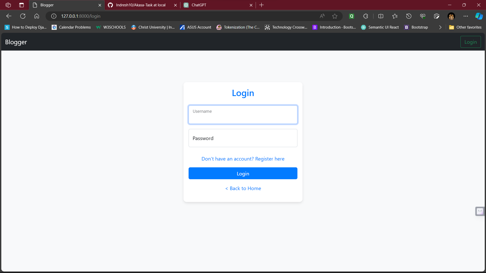
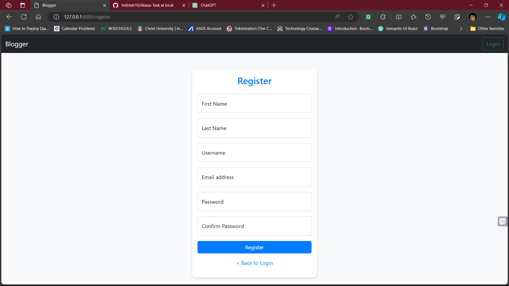
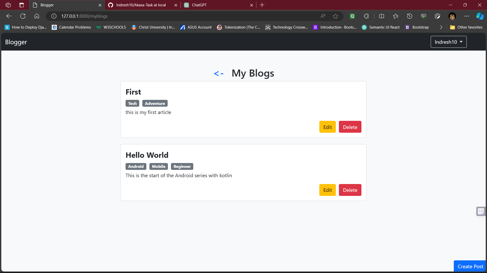
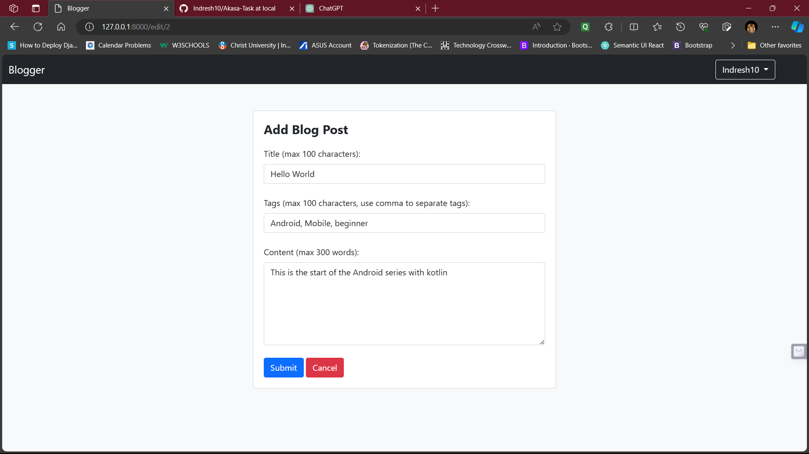
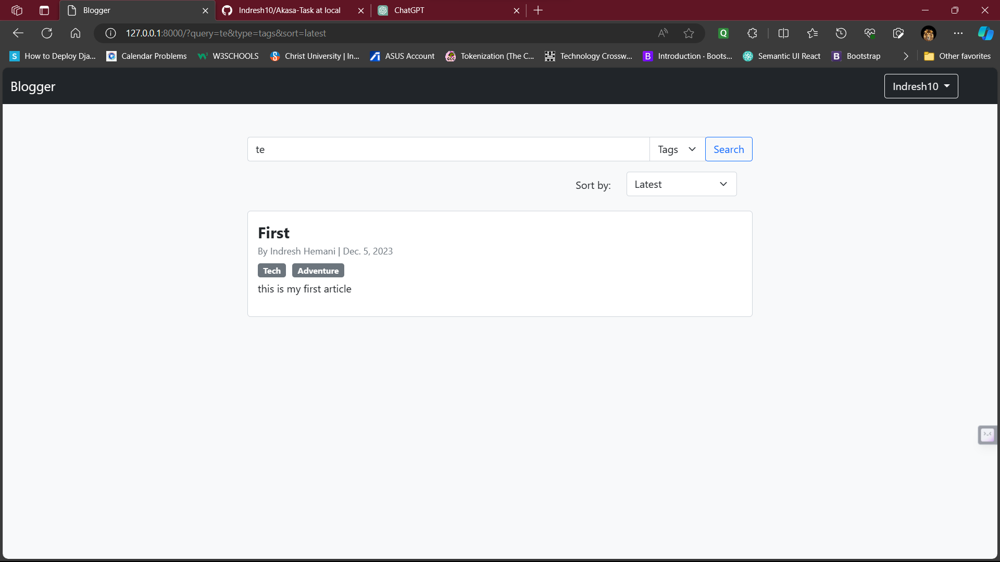
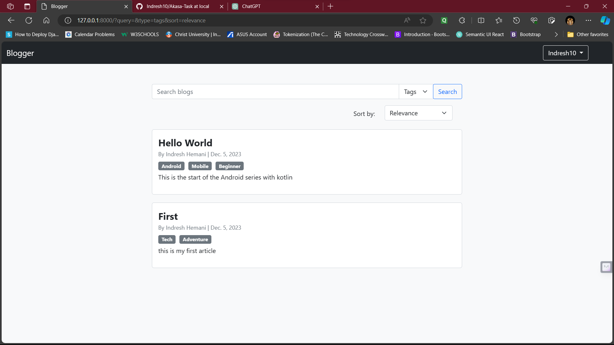
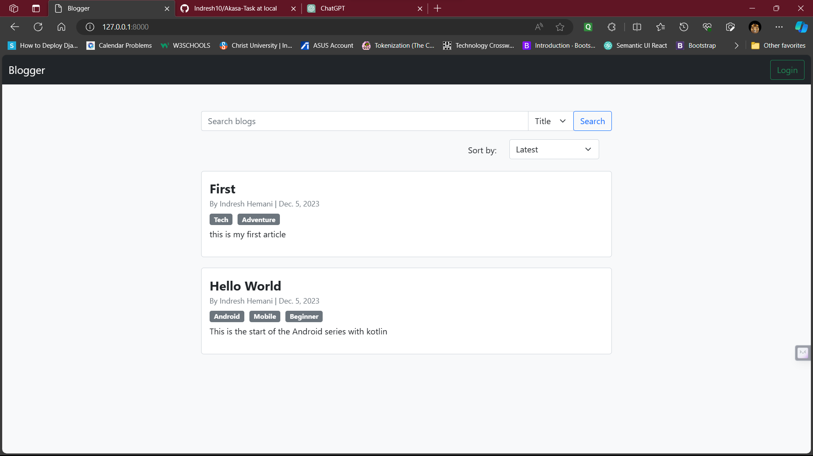

# Blogging Platform

## Table of Contents

1. [Introduction](#introduction)
2. [Setup and Installation](#setup-and-installation)
3. [User Registration and Authentication](#user-registration-and-authentication)
4. [Create and Manage Blog Posts](#create-and-manage-blog-posts)
5. [Public Blog Display](#public-blog-display)
6. [User Interface and Design](#user-interface-and-design)
7. [Security](#security)
8. [Hosting](#hosting)

## Introduction

The Blogging Platform is a Django-based web application that enables users to register, create, edit, and delete blog posts. Visitors can view all published blog posts, search for posts based on tags or keywords, and the platform provides a secure and user-friendly interface.

## Setup and Installation

### Prerequisites

- Python (version 3.11.5)
- Django (version 4.2.8)

### Installation Steps

1. Clone the repository: `git clone https://github.com/Indresh10/Akasa-Task.git`
2. Checkout the branch: `git checkout local`
3. Install dependencies: `pip install -r requirements.txt`
4. Navigate to the project directory: `cd blogger`
5. Apply migrations: `python manage.py migrate`
6. Run the development server: `python manage.py runserver`

## User Registration and Authentication

### User Registration

- Users can register using their email and password.

### Authentication

- Secure authentication mechanism using Django's built-in authentication system.

## Create and Manage Blog Posts

### Blog Post Creation

1. Once logged in, users can create new blog posts.
2. Include a title, content (max 300 words), and tags.

### Post Management

1. Users can view and edit their own posts.
2. Users have the ability to delete their posts.

## Public Blog Display

### Display Options

1. Visitors can view all published blog posts.
2. Order can be based on relevance or latest.

### Search Functionality

- Users can search for blog posts based on tags or title.

## User Interface and Design

### User-Friendly Interface

- Designed and implement a responsive and user-friendly interface using Django templates and Bootstrap.

### Key Features

- **Homepage:** A clean and intuitive homepage displaying featured blog posts.
- **Create Blog Post:** An easy-to-use form for users to create new blog posts.
- **View Blog Posts:** A paginated list of blog posts with options for sorting and filtering.

## Security

### Data Protection

- Utilized Django's built-in authentication system for secure user registration and login.
- Implemented CSRF protection to prevent cross-site request forgery attacks.
- Ensured secure password storage using Django's password hashing mechanisms.

### Vulnerability Prevention

- Address common security vulnerabilities using Django's built-in security features.

### Screenshots

## Hosting

### Deployment

- Application is hosted on Vercel and backend on Supabase
